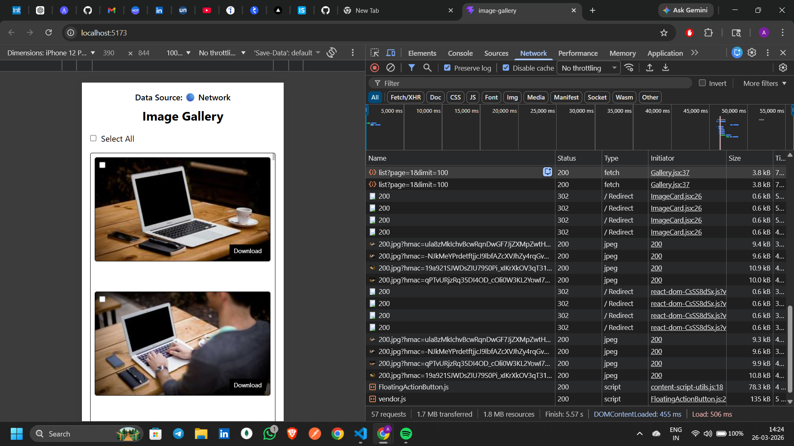
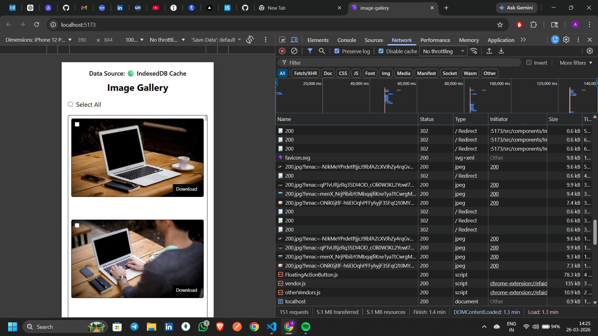

# 📸 High-Performance Image Gallery (React)

## 🚀 Overview

This project is a **high-performance image gallery** built using React, focusing on optimizing rendering, data fetching, and heavy image processing.

It demonstrates advanced frontend concepts like:
- Virtualization (react-window)
- IndexedDB caching
- In-memory caching
- Web Workers
- Canvas-based image processing

---

## 🎯 Features

- 🖼️ Display 100+ images from API  
- ⚡ Smooth scrolling using virtualization  
- 💾 IndexedDB caching (persistent storage)  
- 🧠 In-memory caching for images  
- 🔍 Full-screen image preview modal  
- ⚡ Instant preview with cached images  
- ✅ Select individual or multiple images  
- 📥 Download single or multiple images  
- 🖊️ Watermark added before download  
- 🧵 Background image processing using Web Workers  

---

## 🏗️ Tech Stack

- Frontend: React.js  
- Virtualization: react-window  
- Storage: IndexedDB  
- Image Processing: Canvas API  
- Multithreading: Web Workers  
- Styling: Tailwind CSS  

---

## 📂 Project Structure

src/
│
├── components/
│ ├── Gallery.jsx
│ ├── ImageCard.jsx
│ ├── PreviewModal.jsx
│
├── utils/
│ ├── indexedDB.js
│ ├── imageCache.js
│ ├── previewImageCache.js
│ ├── watermark.js
│
├── workers/
│ └── imageWorker.js
│
├── App.jsx
└── main.jsx

---

## ⚡ Performance Optimizations

### 1️⃣ Virtualization (react-window)

- Used `FixedSizeGrid` to render only visible images  
- Reduces DOM nodes significantly  
- Ensures smooth scrolling  

---

### 2️⃣ IndexedDB Caching

- Stores API data in browser database  
- First load → fetch from API  
- Next loads → load from IndexedDB  
- Eliminates unnecessary network requests  

---

### 3️⃣ In-Memory Image Cache

- Implemented using JavaScript `Map`  
- Prevents reloading already rendered images  
- Improves rendering performance  

---

### 4️⃣ Preview Image Cache

- Caches full-size images for modal preview  
- Ensures instant loading on repeated clicks  

---

### 5️⃣ Web Workers

- Image processing runs in a separate thread  
- Prevents blocking the main UI thread  
- Improves responsiveness  

---

### 6️⃣ OffscreenCanvas

- Used inside Web Worker  
- Enables efficient image processing and watermarking  

---

## 🧠 How It Works

### 📌 Image Rendering Flow

1. App checks IndexedDB for cached data  
2. If found → loads instantly from cache  
3. If not → fetches from API and stores in IndexedDB  
4. Only visible images are rendered using virtualization  

---

### 📌 Image Download Flow

1. User clicks download  
2. Image URL is sent to Web Worker  
3. Worker processes the image:
   - Fetches image  
   - Converts to bitmap  
   - Draws on OffscreenCanvas  
   - Adds watermark  
4. Final image blob is returned  
5. Image is downloaded  

---

## 📸 Performance Comparison

### 🔹 BEFORE (First Load - Network Request)

On the first load, the application fetches data from the API.



👉 You can see the API call:
https://picsum.photos/v2/list?page=1&limit=100

---

### 🔹 AFTER (Cached Load - No API Call)

On subsequent reloads, data is loaded from IndexedDB.



👉 No API call is triggered and data loads instantly. 

---

## 📝 Performance Optimization Explanation

Initially, the application fetched image data from the Picsum API on every page load, resulting in repeated network requests and slower performance. To optimize this, IndexedDB was implemented as a client-side persistent storage solution.

On the first load, the application fetches data from the API and stores it in IndexedDB. On subsequent reloads, the app retrieves data directly from IndexedDB instead of making another network request. This significantly reduces load time and improves performance.

Additionally, an in-memory cache using JavaScript Map was implemented to store already loaded images, preventing redundant image loading and improving rendering speed. A preview image cache was also added to optimize modal performance.

As a result, the application now minimizes network dependency, loads faster, and provides a smoother user experience.

---

## 🛠️ Installation & Setup

```bash
# Clone the repository
git clone https://github.com/your-username/your-repo-name.git

# Navigate to project
cd your-repo-name

# Install dependencies
npm install

# Run the app
npm run dev